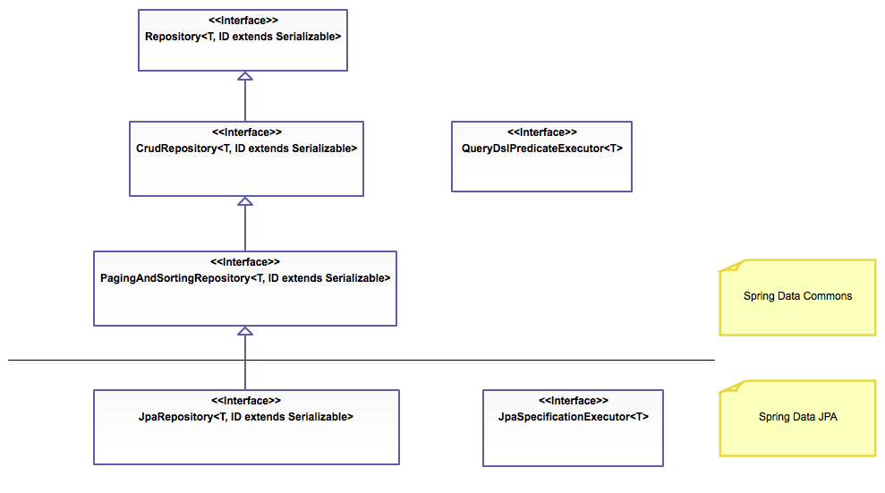

# Spring Data / JPA Notes

## What is Spring Data?

### Spring Data is not a core spring framework!

### It is a family of frameworks for ORM and data persistance who's main purpose is to abstract away code required for data storage, and allows us to focus on business logic

We are specifically learning Spring Data JPA

It essentially abstracts away the use of hibernate and SpringORM, simplifying your Data Access Layer and providing standard implementations for common DAO methods

This means you no longer have to implement these methods, they are simply provided for you by extending the JpaRepository

When you extend JpaRepository Spring will automatically create an implementation for your Dao, including relevant CRUD methods for standard data access, and custom queries based off of method signatures

## Spring Data JPA Interface Hierarchy



## Spring Data JPA Features

-   Building sophisticated repositories based on Spring and JPA
-   Support for QueryDSL predicates and type-safe JPA queries
    -   This is less important/probably won't use. But, QueryDSL is a framework which enables statically typed SQL-like queries instead of requiring inline string queries or XML files.
-   Transparent auditing of Domain classes
-   Pagination support
-   Dynamic Query Execution
-   Support for integration of custom data access code
-   Automatic custom queries
-   Validation of @Query annotated queries during bootstrapping
-   Support of XML based entity mapping
-   JavaConfig based repository configuration by introducing `@EnableJpaRepositories`

## Spring Data JPA Methods

-   Comes with predefined methods:

    -   https://docs.spring.io/spring-data/jpa/docs/current/api/org/springframework/data/jpa/repository/JpaRepository.html
    -   Primarily CRUD operations

-   You can also create custom method signatures to find almost anything you want:

    -   https://docs.spring.io/spring-data/jpa/docs/1.5.0.RELEASE/reference/html/jpa.repositories.html
    -   Take a look at table 2.3 in the above link for examples
    -   These are known as Automatic Custom Queries
    -   When Spring Data creates a new Repository implementation, it analyses all of the methods defined by the interfaces, and attempts to automatically generate queries from the method names. It has limitations, but it is also very powerful and elegant way of defining new custom access methods with very little effort.
    -   These can be fairly complex without writing any implementations

-   You can also use @Query to write JPQ queries, and use QueryDSL as stated above.
    -   You may end up using the @Query annotations on rare occasions
    -   From what I understand from my time in training, you probably won't use QueryDSL

## Do the demo, then come back for these quick notes

## Spring Data Annotations

A quick run down of the different Spring Data Annotations

| Annotation                      | Purpose                                                                                   |
| ------------------------------- | ----------------------------------------------------------------------------------------- |
| @Transactional                  | Configure how the database transaction behaves (Kevin will cover this next)               |
| @NoRepositoryBean               | Creates an interface that provides common methods for child repositories                  |
| @Param                          | Parameters can be passed to queries defined with @Query                                   |
| @Transient                      | Mark a field as transient, to be ignored by the data store engine during reads and writes |
| @CreatedBy, @LastModifiedBy     | Auditing annotations that will automatically be filled with the current principal         |
| @CreatedDate, @LastModifiedDate | Auditing annotations that will automatically fill with current date                       |
| @Query                          | Supply a JPQL query for repository methods                                                |

# DEMO - For my eyes only

1. Create a new spring project by right clicking and selecting new > project > spring starter project
2. Give it a name and change the package to com.example, click next
3. Add Spring Web, Spring Data JPA, H2 Database

-   This should install and configure the dependencies that we need for this project

4. We will first make sure that our database is setup. We want to open up our application.properties and configure our h2 database.

```java
spring.h2.console.enabled=true
spring.datasource.url=jdbc:h2:file:datademo
spring.datasource.driverClassName=org.h2.Driver
spring.datasource.username=users
spring.datasource.password=password
spring.jpa.database-platform=org.hibernate.dialect.H2Dialect
spring.jpa.hibernate.ddl-auto=create
spring.jpa.show-sql=true

server.port=8080
```

-   To access this in memeory database, you simply put localhost:8080/h2-console in the address bar, then enter the information to sign in. Initally you won't see anything because we have yet to add any data yet.

5. Next we want to define a simple entity as a standard Bean. We will be creating a Customer object which will be mapped to a Customer table

```java
package com.example.models;

import javax.persistence.Column;
import javax.persistence.Entity;
import javax.persistence.GeneratedValue;
import javax.persistence.GenerationType;
import javax.persistence.Id;
import javax.persistence.Table;

@Entity
@Table(name = "User")
public class User {

	//We first need to go ahead and crate some attributes for a user

	@Id
	@GeneratedValue(strategy = GenerationType.AUTO)
	//You can optionally add @Column as well
	@Column(name="id")
	private int id;

	@Column(name="email", unique=true, nullable=false)
	private String email;

	@Column(name="username", unique=true, nullable=false)
	private String username;

	@Column(name="password", nullable=false)
	private String password;

	@Column(name="loggedOn")
	private boolean loggedOn;

	//Next we will make some constructors the old fashioned way, we want one no args that spring will use, and one with first and last name arguments for us to use
	//Use alt+shift+s to open up the source menu and add constructors quickly that way

	public User() {
		super();
	}

	public User(String email, String username, String password) {
		super();
		this.email = email;
		this.username = username;
		this.password = password;
		this.loggedOn = false;
	}

	//Next we want some getters and setters, so we can use the same trick as the constructors to quickly generate them

	public int getId() {
		return id;
	}

	public void setId(int id) {
		this.id = id;
	}

	public String getEmail() {
		return email;
	}

	public void setEmail(String email) {
		this.email = email;
	}

	public String getUsername() {
		return username;
	}

	public void setUsername(String username) {
		this.username = username;
	}

	public String getPassword() {
		return password;
	}

	public void setPassword(String password) {
		this.password = password;
	}

	public boolean isLoggedOn() {
		return loggedOn;
	}

	public void setLoggedOn(boolean loggedOn) {
		this.loggedOn = loggedOn;
	}

	//Finally we will want a simple toString method
	@Override
	public String toString() {
		return "User [id=" + id + ", email=" + email + ", username=" + username + ", password=" + password + "]";
	}

}
```

-   Now if you start up the program, you will see Hibernate doing its thing, and we if we look at the H2 console, we will see that our in memory database now has a table called user

6. We can do move onto our DAO layer, these are now typically going to be called repositories. Mainly because this is what spring refers to them as.

7. Make a new interface in the com.example.repositories package and call it CustomerRepository

```java
package com.revature.repository;

import java.util.List;

import org.springframework.data.jpa.repository.JpaRepository;
import com.revature.models.Customer;

/*
 * Note that the generics for the JpaRepository should match the associated
 * model followed by the datatype of its id
 */
public interface CustomerRepository extends JpaRepository<Customer, Integer> {

  List<Customer> findByLastName(String lastName);

  Customer findById(Integer id);
}
```

-   As you can see, instead of writing out the methods to talk to the database through hibernate, you literally just have to create method signatures, and Spring Data will do the rest of the work.

8. Next we can create a quick service layer for our application. In our case we are basically just calling the repository methods and error checking, but you can imagine how you might need some sort of logic here.

-   Create a new package com.example.service and a new class called UserService

```java
package com.example.service;

import org.springframework.beans.factory.annotation.Autowired;
import org.springframework.stereotype.Service;

import com.example.models.User;
import com.example.repository.UserRepository;

//We will use Springs stereotype annotation to mark our class as a repository
@Service
public class UserService {

	private UserRepository uRepo;

	//Start by making a no args and all args constructor, autowire the all args constructor

	public UserService() {

	}

	@Autowired
	public UserService(UserRepository repo) {
		this.uRepo = repo;
	}

	public String registerUser(String email, String username, String password) {
		try{
			uRepo.save(new User(email, username, password));
			return "User created successfully";
		}
		catch(Exception e) {
			return "User was not created successfully";
		}
	}

	public String loginUsername(String username, String password) {
		try {
			User loggedIn = uRepo.findUserByUsernameAndPassword(username, password);
			if(loggedIn == null) {
				return "User login failed";
			}
			else {
				loggedIn.setLoggedOn(true);
				uRepo.save(loggedIn);
				return "User login successful";
			}
		} catch(Exception e) {
			return "User login failed";
		}
	}

	public User searchUsers(String username, String email) {
		try {
			return uRepo.findUserByUsernameOrEmail(username, email);
		} catch(Exception e) {
			return null;
		}

	}

}
```

-   If you noticed that we used the .save() method, this is one of the built in methods in the JpaRepository

9. Finally we can make our controller layer.

-   Make a new package called com.example.controller and a new class called UserController
-   We will use @RestController because this will automatically include @ResonseBody and @Controller
-   We will also give RequestMapping a value of /user so we know where to route our requests

```java
package com.example.controller;

import java.util.LinkedHashMap;

import org.springframework.beans.factory.annotation.Autowired;
import org.springframework.http.HttpStatus;
import org.springframework.http.ResponseEntity;
import org.springframework.web.bind.annotation.GetMapping;
import org.springframework.web.bind.annotation.PathVariable;
import org.springframework.web.bind.annotation.PostMapping;
import org.springframework.web.bind.annotation.RequestBody;
import org.springframework.web.bind.annotation.RequestMapping;
import org.springframework.web.bind.annotation.RestController;

import com.example.models.User;
import com.example.service.UserService;

@RestController
@RequestMapping(value="/user")
public class UserController {

	private UserService uServ;

	@Autowired
	public UserController(UserService serv) {
		this.uServ = serv;
	}

	@PostMapping(value="/register")
	public ResponseEntity<String> registerUser(@RequestBody LinkedHashMap<String, String> uMap){
		String message = uServ.registerUser(uMap.get("email"), uMap.get("username"), uMap.get("password"));
		return new ResponseEntity<String>(message, HttpStatus.OK);
	}

	@PostMapping(value="/login")
	public ResponseEntity<String> loginUser(@RequestBody LinkedHashMap<String, String> uMap){
		String message = uServ.loginUsername(uMap.get("username"), uMap.get("password"));
		return new ResponseEntity<String>(message, HttpStatus.OK);
	}

	@GetMapping(value="/search/{search}")
	public ResponseEntity<User> searchUsers(@PathVariable("search")String search){
		User retrieved = uServ.searchUsers(search, search);
		return new ResponseEntity<User>(retrieved, HttpStatus.OK);
	}
}
```

-   Finally I can give you a quick example of using @Query Annotation

-   Go back to the UserRepository class and add this block of code:

```java
@Query("SELECT u FROM User u WHERE u.loggedOn = true")
List<User> findAllLoggedOnUsers();
```

-   We should now add a service method to stay consistent

```java
public List<User> getLoggedOnUsers(){
		return uRepo.findAllLoggedOnUsers();
	}
```

-   Finally we can add our final controller method

```java
@GetMapping(value="/loggedOn")
	public ResponseEntity<List<User>> getLoggedOn(){
		List<User> uList = uServ.getLoggedOnUsers();
		return new ResponseEntity<List<User>>(uList, HttpStatus.OK);
	}
```
